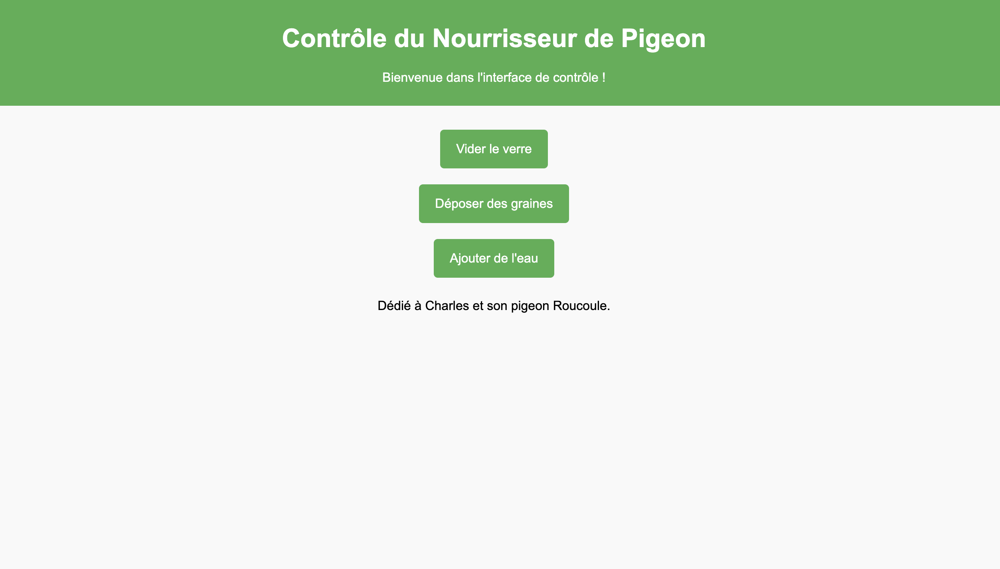

# Documentation : Contrôle du Dispositif de Nourrissage pour Pigeon

Ce document décrit le fonctionnement et l'utilisation d'un programme Python pour contrôler un dispositif de nourrissage automatique pour pigeon via un Raspberry Pi. Ce dispositif comprend deux servomoteurs et une électrovanne contrôlés à distance par des requêtes HTTP.

## Matériel Requis
- **Raspberry Pi** (avec Python installé)
- **Servomoteur** :
  - "flush" : contrôle l'inclinaison d'un verre pour le vider.
  - "seeds" : contrôle un réservoir contenant des graines.
- **Électrovanne** : contrôle l'arrivée d'eau.
- Connexions aux broches GPIO du Raspberry Pi.

## Configuration des GPIO
Les connexions des composants au Raspberry Pi doivent être configurées comme suit :
- Servo "flush" : Pin GPIO 17
- Servo "seeds" : Pin GPIO 27
- Électrovanne "water" : Pin GPIO 22

Vous pouvez ajuster ces pins dans le code en fonction de votre câblage.

## Fonctionnalités
Le programme fournit trois actions principales :

1. **Vider le verre** :
   - Incline le verre à l'aide du servo "flush" pour le vider.
2. **Déposer des graines** :
   - Ouvre le réservoir de graines pendant 3 secondes à l'aide du servo "seeds".
3. **Ajouter de l'eau** :
   - Active l'électrovanne pour ajouter de l'eau pendant 2 secondes.

## Schémas
### Schéma de Connexion
Voici un exemple de schéma de câblage pour connecter les composants au Raspberry Pi :

```plaintext
+---------------------+
|     Raspberry Pi    |
|                     |
|  GPIO 17 --- Servo flush  
|  GPIO 27 --- Servo seeds  
|  GPIO 22 --- Electrovanne |
|                     |
+---------------------+
```

### Schéma du Dispositif
```plaintext
          [Réservoir]
              |
              v
   [Servo Seeds] ---> [Verre]
              |
              v
   [Electrovanne] --> [Eau]
```

## Endpoints HTTP
Le programme ouvre un serveur HTTP sur le port `8080` pour recevoir des commandes. Voici les endpoints disponibles :

| Endpoint   | Description                          |
|------------|--------------------------------------|
| `/flush`   | Vide le verre                        |
| `/seeds`   | Dispense des graines dans le verre   |
| `/water`   | Ajoute de l'eau dans le verre        |

### Exemples de requêtes
Vous pouvez utiliser un navigateur ou un outil comme `curl` pour envoyer des requêtes :

- **Vider le verre** :
  ```bash
  curl http://<IP_RASPBERRY>:8080/flush
  ```
- **Déposer des graines** :
  ```bash
  curl http://<IP_RASPBERRY>:8080/seeds
  ```
- **Ajouter de l'eau** :
  ```bash
  curl http://<IP_RASPBERRY>:8080/water
  ```

## Dépendances
Assurez-vous d'installer les dépendances Python nécessaires :

```bash
pip install gpiozero
```

## Code Source
Le code Python est disponible ci-dessous. Lancez ce script pour démarrer le serveur HTTP et contrôler les actions du dispositif :

```python
from gpiozero import Servo, OutputDevice
from http.server import BaseHTTPRequestHandler, HTTPServer
import time

# Configuration des servomoteurs et de l'électrovanne
servo_flush = Servo(17)
servo_seeds = Servo(27)
electrovalve_water = OutputDevice(22)

def flush_glass():
    servo_flush.max()
    time.sleep(1)
    servo_flush.min()

def dispense_seeds():
    servo_seeds.max()
    time.sleep(3)
    servo_seeds.min()

def add_water():
    electrovalve_water.on()
    time.sleep(2)
    electrovalve_water.off()

class RequestHandler(BaseHTTPRequestHandler):
    def do_GET(self):
        if self.path == '/flush':
            flush_glass()
            self.send_response(200)
            self.end_headers()
            self.wfile.write(b"Glass flushed")
        elif self.path == '/seeds':
            dispense_seeds()
            self.send_response(200)
            self.end_headers()
            self.wfile.write(b"Seeds dispensed")
        elif self.path == '/water':
            add_water()
            self.send_response(200)
            self.end_headers()
            self.wfile.write(b"Water added")
        else:
            self.send_response(404)
            self.end_headers()
            self.wfile.write(b"Command not found")

server_address = ('', 8080)
httpd = HTTPServer(server_address, RequestHandler)
print("Server running on port 8080...")
httpd.serve_forever()
```

## Remarques
- **Sécurité** : Le serveur HTTP n'est pas sécurisé et ne doit pas être exposé à Internet sans protection supplémentaire.
- **Tests** : Vérifiez les connexions des GPIO avant de lancer le programme pour éviter tout dommage matériel.

## Dépannage
- Si les servos ou l'électrovanne ne fonctionnent pas comme prévu, vérifiez :
  - Les connexions électriques.
  - La configuration des broches GPIO dans le code.
  - La tension d'alimentation des composants.

---

## Site web

- Un Site web facilite les requêtes ! 
- Le script utilise : 
```html
	<script>
		function sendRequest(endpoint) {
			fetch(`http://${window.location.hostname}:8080/${endpoint}`)
				.then(response => {
					if (response.ok) {
						return response.text();
					} else {
						throw new Error("Erreur lors de la requête");
					}
				})
				.then(data => alert(data))
				.catch(error => alert(error));
		}
	</script>
```




*Dédié à Charles et à son pigeon "Roucoule", source d'inspiration pour ce projet.*

